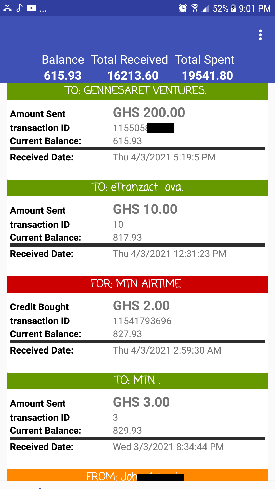
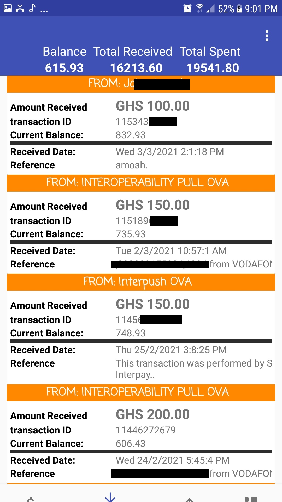
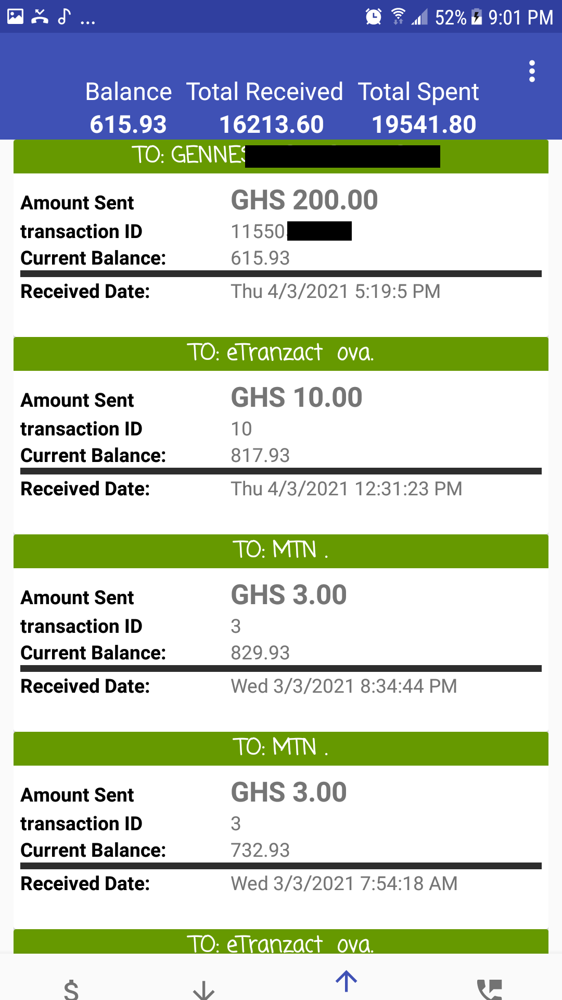
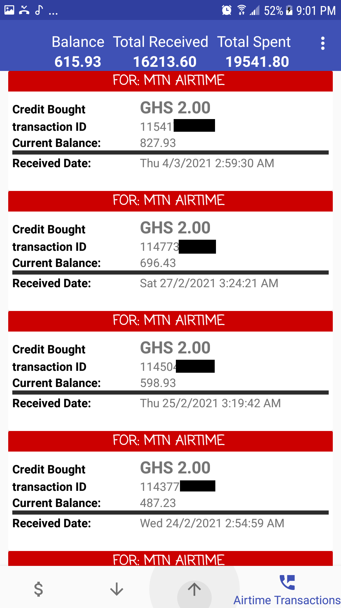

# momomanager
[](https://jitpack.io/#Zakaria16/momomanager)


## Quick links
- [How to use the library](#use_lib)
- [App screenshots]()
- [API Documentation](momomanager/doc)

## Overview
Easily read mobile money transaction records and detect Momo fraud messages. Currently working on mtn mobile money

The app allows you to know your current balance, the total amount you have received so far and the total amount you have spent.

It groups your transaction into categories

* Received transactions
* Sent Transactions
* Airtime Transactions
* It detect incoming SMS to verify if it is a legit Mobile Money message
## App Screenshot
All transactions|Received Transaction|sent transaction|Airtime transaction
-----------------|----------------|-----------------|----------------
|||

### current balance and all time Money received and spent
Get to know your current balance and the total amount you have spent and received thus far

### Detect fraud Momo messages
detect whether incoming mobile money message is legit and alert you. The app only show Momo transactions from the network operator if its not from the operator is not shown

### All Transactions
At this section you get to see all your transactions beautifully differentiated with colors

### Received Transactions
This category shows all mobile money transaction you have received so far. you easily read the amount, the transaction ID and the date it was received

### Spent Transactions
This category shows all mobile money transaction you have sent from your device so far. you easily read the amount, the transaction ID and the date it was sent

### Airtime Transactions
At this category you will know the amount you are spending on airtime


## <a name="use_lib"></a> How to use the library
Step 1. Add it in your root build.gradle at the end of repositories:
```java
allprojects {
	repositories {
		...
		maven { url 'https://jitpack.io' }
	}
}
```

Step 2. Add the dependency
```java
dependencies {
    ...
    implementation 'com.github.Zakaria16.momomanager:momomanager:VERSION_NAME'
}
```

### Using the library
first allow sms read permission and receive permision(if you want to analyze incoming sms)

in the app's ***AndroidManifest.xml***

```
...

<uses-permission android:name="android.permission.READ_SMS" />
<uses-permission android:name="android.permission.RECEIVE_SMS" />

...

```

Example on how to read momo data:

```java
MtnMomoManager mtnMomoManager = new MtnMomoManager(context);
//get the sum of all received momo amount
double receivedAmount = mtnMomoManager.getTotalReceivedAmount();
//get the sum of all sent momo amount
double totalSent = mtnMomoManager.getTotalSentAmount();
//get the current momo balance
double currentBalance = mtnMomoManager.getLatestBalance();

List<Momo> resList;
//list of all momo data
resList = mtnMomoManager.getMomoData(ExtractMtnMomoInfo.ALL_MOMO);
//list of all received momo data
resList = mtnMomoManager.getMomoData(ExtractMtnMomoInfo.RECEIVED_MOMO);
//list of all sent momo data
resList = mtnMomoManager.getMomoData(ExtractMtnMomoInfo.SENT_MOMO);

//list of all momo used to buy airtime
resList = mtnMomoManager.getMomoData(ExtractMtnMomoInfo.CREDIT_MOMO);

```

Read the API Documentation here: [API Doc](https://github.com/Zakaria16/momomanager/tree/master/momomanager/doc)
